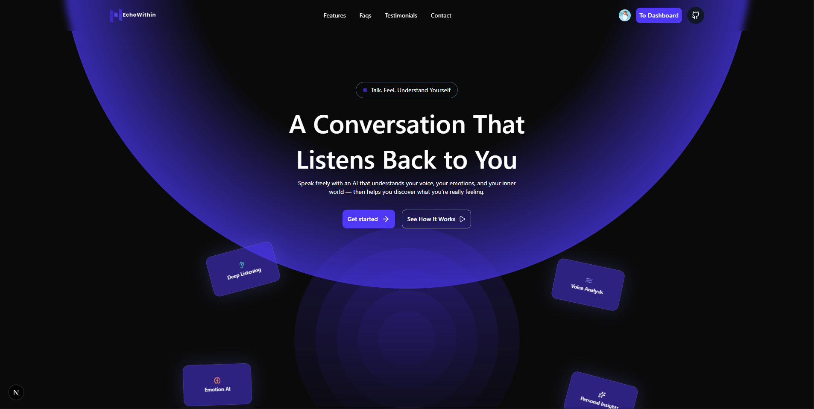
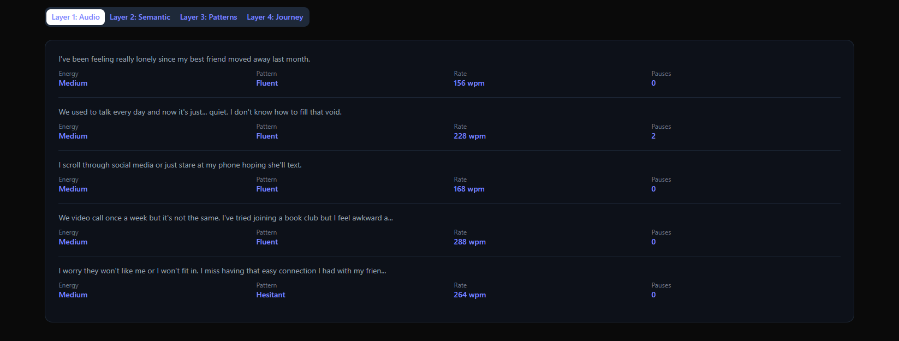
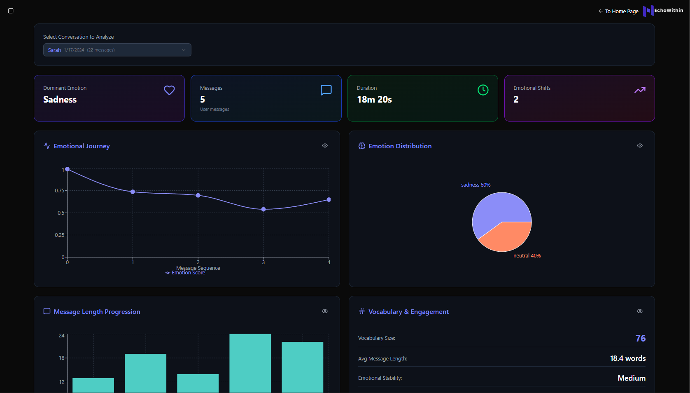
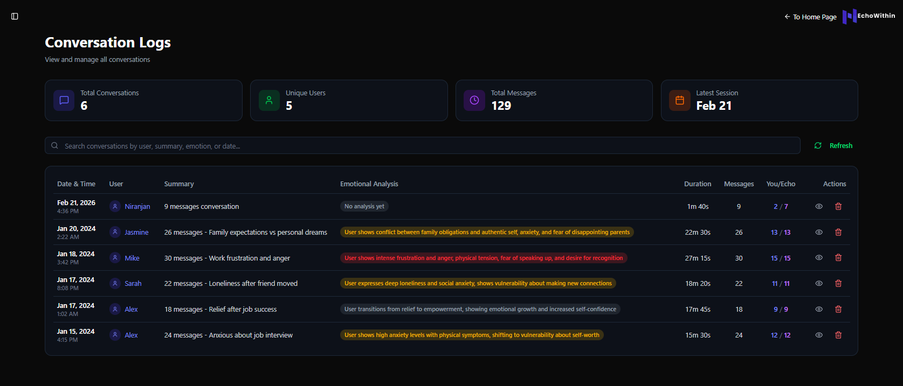

# EchoWithin: A Real-Time Voice-Based AI for Emotional Awareness & Happiness

#### 🎓 Course – Happiness & Well-being (Academic Project)
#### 👥 Team Name – CODE4CHANGE
#### 💡 Project Theme – *Understanding Emotions Through Voice-Based AI*
#### 📩 Contact Email – niranjanpraveen@gmail.com

---

## 🌱 A Brief of the Prototype
  

**EchoWithin** is a full-stack **voice-first AI web application** that enables users to communicate in real time with an emotionally aware AI agent named **Echo**, speaking in a warm, natural human accent.  

The platform encourages users to **express themselves freely through voice**, after which a multi-layered analysis engine processes both **spoken content and vocal patterns** to generate **personalized emotional insights**.  

Designed as part of a happiness-focused academic project, EchoWithin prioritizes **self-awareness, reflection, and emotional literacy** rather than productivity or diagnosis.  

Unlike text-based chatbots, EchoWithin leverages **real-time speech interaction** to capture deeper emotional signals and present them back to users in a meaningful, reflective manner — helping users understand not just what they said, but how they said it.

---

## 🧩 Modules Overview

### 🎙️ 1. Real-Time Voice AI Conversation with Echo
  

A **live voice communication module** that allows users to talk naturally with Echo, an emotionally-aware AI companion.  
- Real-time speech-to-text and text-to-speech using **Vapi AI**  
- Warm, calm, human-like voice with thoughtful pauses  
- Dynamic response pacing that matches user's emotional state  
- Visual feedback with **ping animations** showing who is speaking  
- Microphone toggle and connection status indicators  
- Loading modal during connection establishment  

> 💬 Echo listens 70% of the time and speaks 30%, creating a safe space for emotional expression.

---

### 🧠 2. Four-Layer Emotion Interpretation Engine
  

After each conversation, a sophisticated **multi-layer analysis engine** processes both content and vocal patterns:

#### 🔹 Layer 1: Audio Processing (Real-time)
- Voice tone analysis (pitch, energy, tempo)  
- Speech pattern detection (pauses, fillers, speed changes)  
- Vocal quality assessment (breathiness, clarity)  

#### 🔹 Layer 2: Semantic Analysis  
- Emotion keyword and phrase detection  
- Sentence structure analysis  
- Topic shift identification  
- Sentiment scoring  

#### 🔹 Layer 3: Conversational Dynamics  
- Response timing and latency  
- Interruption patterns  
- Engagement level tracking  
- Topic consistency monitoring  

#### 🔹 Layer 4: Cross-Modal Fusion  
- Audio-text alignment  
- Emotional contradiction detection  
- Temporal emotion tracking  
- Generation of **personalized emotional insights**  

**Sample Insight Output**
> "You spoke with confidence while discussing goals, but your tone softened when talking about personal expectations, suggesting a desire for reassurance."

> 🌿 Designed to promote awareness, not evaluation.

---

### 📊 3. Comprehensive Conversation Analysis Dashboard
  

A rich, interactive dashboard providing **deep emotional analytics** from conversations:
- **Overall Metrics Cards**: Dominant emotion, message count, duration, emotional shifts  
- **Emotional Journey Timeline**: Line chart tracking emotional intensity over time  
- **Emotion Distribution**: Pie chart showing breakdown of emotions expressed  
- **Message Length Progression**: Bar chart revealing engagement patterns  
- **Vocabulary & Engagement Metrics**: Vocabulary size, average message length, emotional stability  
- **Layer-by-layer detailed analysis** with expandable tabs  
- **Educational tooltips** (eye icons) explaining what each chart means

> 📈 Users can select any past conversation from a dropdown and instantly see its emotional analysis.

---

### 📝 4. Conversation History & Logs
  

A **responsive table interface** for managing all past conversations:
- **User-specific data**: Only shows conversations from the currently signed-in user (Clerk authentication)  
- **Search functionality**: Filter by date, summary, or emotional analysis  
- **Sortable columns**: Date, user, duration, message count  
- **Summary cards**: Total conversations, unique users, total messages, latest session  
- **Action buttons**: View detailed analysis or delete conversations  
- **Delete with confirmation**: Users can remove their own conversations  
- **Emotion badges**: Color-coded based on emotional summary  

> 🗂️ Every conversation is stored in **Supabase** with complete transcript JSON for future analysis.

---

### 💾 5. Secure Data Storage with Supabase

All conversations are securely stored in **Supabase (PostgreSQL)** with a comprehensive schema:
- **User information**: Clerk user ID, name, and session tracking  
- **Conversation metadata**: Start/end times, duration, message counts  
- **Full transcript storage**: Complete conversation JSON for replay and analysis  
- **Emotional analysis fields**: Audio features, emotion analysis, emotional summary  
- **Future-ready**: Fields for storing all four layers of analysis results  

> 🔒 **Privacy-first design**: All data is associated with authenticated users and protected by Clerk authentication.

---

### 🧱 6. Bento Grid Experience (Frontend UX)

A **modern Bento-style grid layout** presenting key features and insights:  
- Voice sessions overview  
- Emotional summaries  
- Reflection highlights  
- Progress over time  

**Design Highlights**
- Glassmorphism cards  
- Soft gradients and rounded layouts  
- Micro-interactions for emotional feedback  
- Fully responsive design  

> 🧩 Enhances clarity and calmness through thoughtful UI design.

---

### 🔐 7. User Authentication with Clerk

Secure user management powered by **Clerk**:
- Sign-up, sign-in, and profile management  
- User-specific data isolation  
- Session tracking and management  
- Profile images and user metadata  
- Protected API routes ensuring data privacy  

> 👤 Every user sees only their own conversations and emotional insights.

---

## 🎨 Design Language & Theme

**Theme Name:** Calm Cognition  

- **Primary:** Midnight Indigo `#1E1E2F`  
- **Secondary:** Soft Lavender `#8B8DF8`  
- **Accent:** Warm Coral `#FF8A65`  
- **Positive Highlight:** Mint Glow `#4ECDC4`  

The visual identity is crafted to feel **safe, introspective, and emotionally inviting**, aligning with the project’s happiness-driven goals. The dark theme reduces eye strain during reflective conversations.

---

## 🧰 Tech Stack

| Layer | Technologies |
|------|-------------|
| **Frontend** | Next.js 15 · TypeScript · Tailwind CSS · ShadCN UI · Framer Motion |
| **3D & Graphics** | Three.js · React Three Fiber · GLB Models |
| **Backend** | Next.js API Routes · Python Flask (Analysis Service) |
| **Database** | Supabase (PostgreSQL) · Prisma ORM |
| **Authentication** | Clerk · Kinde (legacy) |
| **Voice AI** | Vapi (STT + TTS) · Web Audio API |
| **AI & NLP** | Hugging Face Transformers · Custom emotion analysis models |
| **Data Visualization** | Recharts · ResponsiveContainer |
| **Deployment** | Vercel · Railway (Flask) |

---

## 🗄️ Database Schema

```prisma
model Conversation {
  id                 String   @id @default(cuid())
  session_id         String   @unique
  user_id            String
  user_name          String?
  start_time         DateTime
  end_time           DateTime
  total_duration     Int
  created_at         DateTime @default(now())
  total_messages     Int
  user_messages      Int
  assistant_messages Int
  transcript_json    Json?
  transcript_summary String   @db.VarChar(1000)
  audio_features     Json?
  emotion_analysis   Json?
  emotional_summary  String?

  @@index([user_id])
  @@index([created_at])
}
```

---

## 🔄 Data Flow Architecture

```
User Speaks → Vapi AI (Real-time) → Web Audio API Analysis → Transcript Generation
       ↓                              ↓
┌──────────────┐              ┌──────────────┐
│  Conversation│              │  Layer 1-3   │
│  Storage     │ ←────────────│  Analysis    │
└──────────────┘              └──────────────┘
       ↓                              ↓
┌──────────────┐              ┌──────────────┐
│   Supabase   │              │  Flask API   │
│   Database   │              │  (Layer 4)   │
└──────────────┘              └──────────────┘
       ↓                              ↓
┌──────────────┐              ┌──────────────┐
│   Logs Page  │ ←────────────│  Analysis    │
│              │              │  Dashboard   │
└──────────────┘              └──────────────┘
```

---

## 🌟 Novelty of the Project

- **Voice-first emotional reflection**, not text-based chatting  
- **Four-layer emotion analysis** combining audio + text + behavioral patterns  
- **Real-time voice processing** with Web Audio API for instant feedback  
- **Post-conversation emotional mirroring** with contradiction detection  
- **Educational visualizations** explaining emotional insights to users  
- **Secure user-specific storage** with full conversation history  
- Designed for **happiness, awareness, and introspection**, not productivity  
- Combines **real-time interaction + reflective AI insight** in one seamless experience  

---

## 🚀 Key Features Implemented

| Feature | Description |
|---------|-------------|
| **Voice Conversation** | Real-time talk with Echo using Vapi AI |
| **Visual Feedback** | Ping animations showing who's speaking |
| **Conversation Saving** | One-click save to Supabase database |
| **User Authentication** | Secure login with Clerk |
| **Conversation Logs** | Browse, search, and delete past conversations |
| **Emotion Analysis** | 4-layer analysis with Python Flask backend |
| **Interactive Charts** | Timeline, distribution, and progression visualizations |
| **Educational Tooltips** | Eye icons explaining chart interpretations |
| **Responsive Design** | Works seamlessly on mobile and desktop |
| **Dark Theme** | Calm, eye-friendly interface |

---

## 🔗 References & Inspiration

- **Replika** – Emotional AI companion  
- **Wysa** – Mental health chatbot  
- **Hume AI** – Emotion-aware voice systems  
- **Apple Journal** – Reflection-driven well-being concepts  
- **ShadCN UI** – Beautiful, accessible component library  
- **Vapi** – Voice AI infrastructure  
- **Supabase** – Open-source Firebase alternative  

> EchoWithin differentiates itself by uniting *real-time voice interaction* with *post-session emotional insights*, creating a complete loop from expression to understanding.

---

## 🚀 Future Scope

- **Emotion trend tracking** across multiple sessions  
- **Personal emotional growth dashboard** with progress metrics  
- **Multi-language and cultural accent support**  
- **Journaling + voice reflection integration**  
- **Research-backed happiness metrics** and wellbeing scores  
- **Export functionality** for personal records  
- **AI-generated reflection prompts** based on conversation patterns  
- **Integration with mental health resources** for critical situations  

---

## 🌈 Why It Matters

EchoWithin transforms simple conversation into a tool for **self-discovery**.  

By listening not just to words but to **emotion embedded in voice**, the platform helps users understand themselves better — a critical step toward emotional well-being and happiness. The combination of real-time voice interaction, comprehensive analysis, and intuitive visualization creates a unique space for **reflection, growth, and emotional literacy**.

> *“Sometimes, being heard is the first step to understanding yourself.”*

---

## 👥 Contributors

**Team CODE4CHANGE**
- Project Lead & Developer: Niranjan Praveen
- Academic Mentor: [Name]
- Course: Happiness & Well-being

---

## 📄 License

This project is created for academic purposes as part of the Happiness & Well-being course.

---

> *"EchoWithin: Where your voice meets emotional intelligence."*